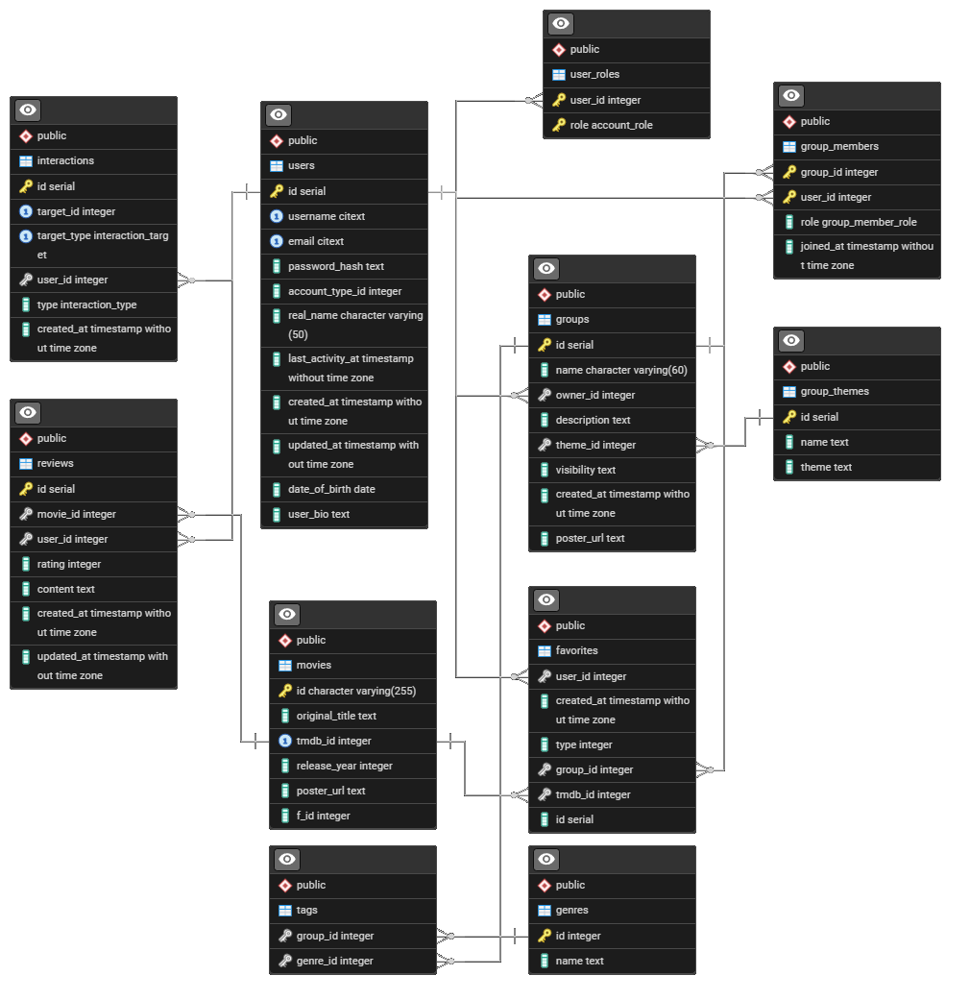

# MovieTok Documentation 📚

Welcome to the MovieTok project documentation repository. This repository contains all the essential documentation, design resources, and project materials for the MovieTok movie discovery and social platform.

## 📋 Table of Contents

- About MovieTok
- Documentation Resources
- Project Materials
- License
## 🎯 About MovieTok

MovieTok is a social movie platform that brings movie enthusiasts together. Users can discover movies, create watchlists, join groups, and share their movie experiences with friends.

## 📚 Documentation Resources

### API Documentation
Complete API documentation with all endpoints, request/response examples, and authentication details:

🔗 **[View API Documentation](https://documenter.getpostman.com/view/48372179/2sB3QNp8SC)**

### UI/UX Design
Complete design system, user interface mockups, and user experience flows:

🔗 **[View Figma Design](https://www.figma.com/design/VWFJB1JoGzFQ0AYPWaehXB/MovieTok_UIUX?node-id=76-2&p=f&t=Vg05zeNb8i2zvZ5k-0)**

### Database ER Diagram
Entity-Relationship diagram showing the database structure and relationships:

## 📄 License

This project is licensed under the MIT License - see the [LICENSE](LICENSE) file for details.

---

For technical implementation details, please refer to the main project repositories.
